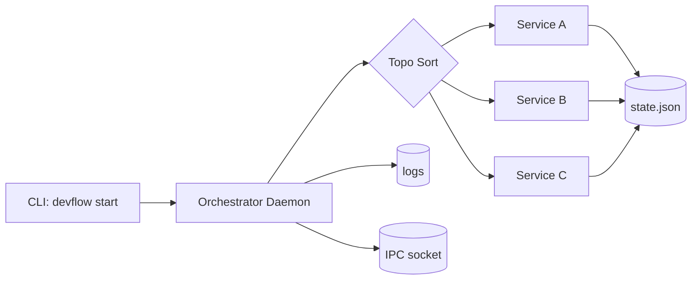

# DevFlow

[](https://github.com/anandyadav3559/devflow/actions/workflows/test.yml)
[](https://go.dev/)
[](./LICENSE)

**A concurrent Linux service orchestrator in Go that launches multi-service dev workflows from declarative YAML and cleans them up deterministically.**

## Installation Guides

Use the distro-specific guides outside this README:

- Fedora: `docs/README-fedora.md`
- Non-Fedora Linux: `docs/README-linux.md`

## Architecture



## Key Engineering Choices

- Concurrency: goroutines + `sync.WaitGroup` + mutex-protected process map for non-blocking orchestration.
- Dependency integrity: Kahn topological sort enforces startup order; cleanup runs in reverse order.
- Linux-native operations: daemonized orchestrator (`setsid`) and terminal-aware service spawning.
- Resilience: stale PID filtering and explicit error propagation in storage/bootstrap paths.
- Quality gate: local pre-commit + CI workflow run format checks, tests, and race tests.

## Quick Start

```bash
devflow build -f workflows/workflow.yml
devflow start -f workflows/workflow.yml
devflow active
devflow stop <workflow_name>
```

## How To Build a Workflow YAML

Create a file like `workflows/myapp.yml`.

### Compulsory (required) fields

- Top level:
  - `workflow_name`
  - `services`
- Per service:
  - `command`

### Uncompulsory (optional) fields

- Top level:
  - `log`
  - `on_close`
- Per service:
  - `args`
  - `path`
  - `depends_on`
  - `port`
  - `detached`
  - `log`
  - `vars`
  - `on_close`

## Workflow Spec (minimal)

```yaml
workflow_name: myapp
log: true

services:
  db:
    command: docker
    args: ["compose", "up", "-d", "postgres"]
    path: ~/myapp/infra
    port: 5432

  api:
    command: go
    args: ["run", "./cmd/api"]
    path: ~/myapp/backend
    depends_on: ["db"]
```

### Field-by-field brief explanation

- `workflow_name`: unique workflow identifier used in state/log naming.
- `services`: map of service names to service definitions.
- `command`: executable/binary to run (example: `go`, `docker`, `npm`).
- `args`: argument array passed to `command`.
- `path`: working directory before running the command (`~` supported).
- `depends_on`: service names that must start first.
- `port`: port readiness check before dependents start.
- `detached`: run silently in background (`true`) instead of new terminal.
- `log`: enable logging for that service.
- `vars`: environment key/value pairs for that service process.
- `on_close`: cleanup command(s) to run on service/workflow shutdown.

### `command` and `on_close` examples

```yaml
services:
  backend:
    command: go
    args: ["run", "./cmd/api"]
    path: ~/myapp/backend
    on_close:
      - command: pkill
        args: ["-f", "cmd/api"]
```

## What DevFlow Creates on Disk

DevFlow uses:

- Primary: `~/.config/devflow/`
- Fallback: `~/.devflow/` (if `os.UserConfigDir()` is unavailable)

Created files/folders include:

- `flows/<name>.yml`: registered workflow snapshots from `devflow build`
- `storage/workflows.json`: workflow registry
- `storage/<workflow>.state.json`: active service PID/state tracking
- `<workflow>.pid`: daemon PID file
- `<workflow>.sock`: daemon IPC socket
- `logs/devflow-daemon-<workflow>-<timestamp>.log`: daemon logs
- `logs/<workflow>-<timestamp>/<service>.log`: per-service logs (when logging enabled)

## Commands

- `devflow build -f <file>`
- `devflow start -f <file>`
- `devflow start -n <registered_name>`
- `devflow active`
- `devflow stop <workflow|workflow.service>`
- `devflow ls`
- `devflow rm <workflow_name>`

## Testing and Quality

Run all checks:

```bash
./testing/scripts/pre_commit_check.sh
```

Install local pre-commit hook:

```bash
./testing/scripts/install_pre_commit_hook.sh
```

CI runs the same gate on push/PR: `.github/workflows/test.yml`.

## Challenges and Learnings

- Race-risk orchestration logic required explicit synchronization and race-test automation.
- External process management needed robust state hygiene (`signal 0` liveness checks + cleanup on exit).
- Error handling quality improved significantly by removing panic/silent-failure paths in bootstrap and storage code.

## License

MIT (`LICENSE`).
