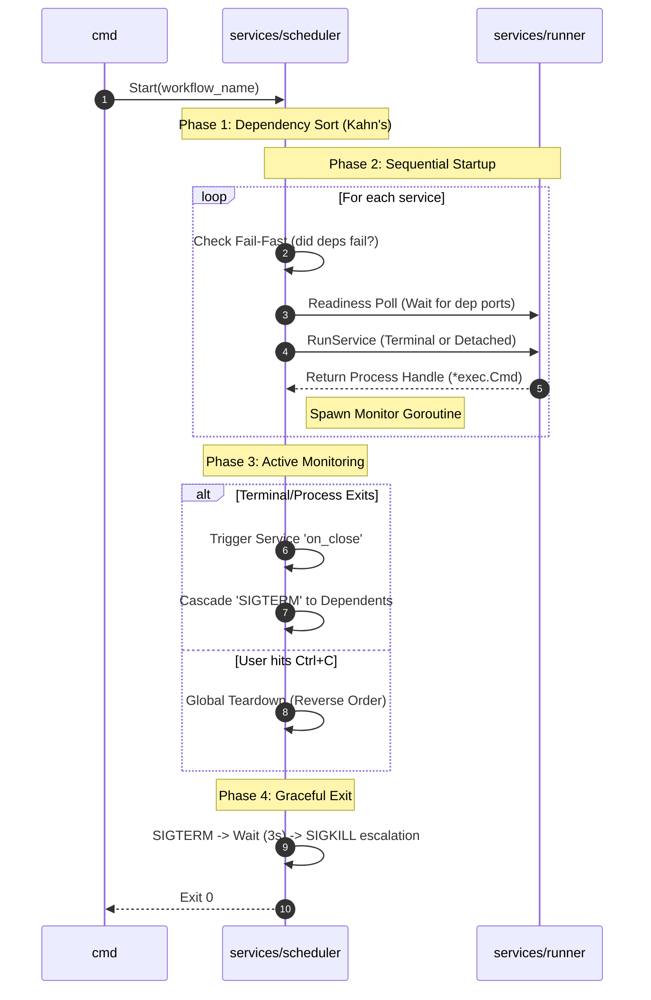

# DevFlow Command Orchestrator

A robust Go-based CLI tool for orchestrating multiple services defined in a YAML workflow. It supports strict dependency management, detached processes, isolated terminal window execution, and intelligent teardowns.

## Overview

DevFlow goes beyond a simple script runner. It natively builds, validates, and snapshots your environment setups into a local `.devflow` registry, ensuring your execution graphs are reproducible and insulated from raw file changes.

## Features

- **YAML Workflows**: Define services, commands, args, and vars. Supports both single-command and list-based `on_close` cleanup.
- **Workflow Registry**: Build and snapshot workflows so they can be securely launched by name from anywhere.
- **Readiness Polling**: Automatically waits for a dependency's port to be active before launching dependent services.
- **Fail-Fast Core**: If a prerequisite service fails to start, all downstream dependents are gracefully skipped to prevent "zombie" states.
- **Safe Cascading Shutdown**: If a terminal window is closed or a process dies, the orchestrator automatically triggers a `SIGTERM` sequence for all services that depend on it.
- **Graceful Termination**: Uses a `SIGTERM` -> `Wait (3s)` -> `SIGKILL` escalation policy to ensure data integrity (no more database corruption).
- **Centralized Logging**: All stdout/stderr streams from orchestrated services are routed to `.devflow/logs/`.
- **Terminal Shell Safety**: Full shell-escaping for environment variables and paths to prevent command injection.

## Commands

DevFlow utilizes a modern CLI structure:

### `devflow build`
Validates your YAML workflow file, checking for syntax errors and circular dependencies. If valid, it snapshots a copy into `.devflow/flows` and registers it with a unique ID in `.devflow/storage/workflows.json`.
```bash
devflow build -f workflows/workflow.yml
```
*If a naming conflict occurs, DevFlow will interactively prompt you to resolve it, or you can force a custom name with `-n <name>`.*

### `devflow start`
Executes an orchestrated workflow. It resolves dependencies, opens physical terminal windows (optionally detached), and monitors ports. You can run raw files or invoke registered snapshots by name.
```bash
devflow start -f workflows/workflow.yml
# OR start a registered snapshot:
devflow start -n bio_geo_guesser_dev
```

### `devflow ls`
Lists all currently registered and snapshotted workflows available in your local DevFlow storage.
```bash
devflow ls
```

### `devflow rm`
Deletes a registered workflow from your registry and cleans up its snapshot file.
```bash
devflow rm bio_geo_guesser_dev
```

## Workflow Configuration Example

```yaml
workflow_name: My Orchestration
services:
  database:
    path: ./db
    command: docker compose up
    on_close:
      command: docker compose down
    port: 5432
  
  api:
    command: ./server
    args: ["--port", "8080"]
    depends_on: ["database"] # Orchestrator will wait for port 5432 before starting this
    on_close:
      command: echo "API shutting down"
```

## In-Depth Internal Mechanics

The Orchestrator operates as a state machine that transitions services from a "discovered" state to an "executed" state. This process is governed by the `TopoSort` engine in `services/scheduler/scheduler.go`.

### Execution Lifecycle



## Running Tests
```bash
go test -v ./...
```
