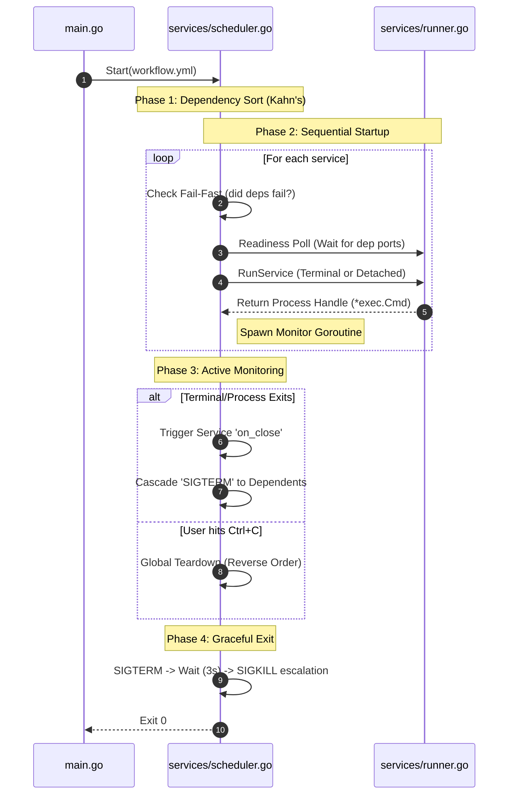

# Command Orchestrator

A Go-based tool for orchestrating multiple services defined in a YAML workflow. It supports dependency management, detached processes, and opening services in new terminal windows.

## Features

- **YAML Workflow**: Define services, commands, args, and vars. Supports both single-command and list-based `on_close` cleanup.
- **Readiness Polling**: Automatically waits for a dependency's port to be active before launching dependent services.
- **Fail-Fast Core**: If a prerequisite service fails to start, all downstream dependents are gracefully skipped to prevent "zombie" states.
- **Safe Cascading Shutdown**: If a terminal window is closed or a process dies, the orchestrator automatically triggers a `SIGTERM` sequence for all services that depend on it.
- **Graceful Termination**: Uses a `SIGTERM` -> `Wait (3s)` -> `SIGKILL` escalation policy to ensure data integrity (no more database corruption).
- **Cleanup Timeouts**: Each `on_close` command is wrapped in a 15-second watchdog timer.
- **Terminal Shell Safety**: Full shell-escaping for environment variables and paths to prevent command injection.

## Workflow Configuration Example

```yaml
workflow_name: My Orchestration
services:
  database:
    path: ./db
    command: docker compose up
    on_close:
      command: docker compose down
    port: 5432
  
  api:
    command: ./server
    args: ["--port", "8080"]
    depends_on: ["database"] # Orchestrator will wait for port 5432 before starting this
    on_close:
      command: echo "API shutting down"
```

## In-Depth Internal Mechanics

The Orchestrator operates as a state machine that transitions services from a "discovered" state to an "executed" state. This process is governed by the `TopoSort` engine in `services/scheduler.go`.

### The Scheduler Loop
1. **Analysis**: The scheduler first scans the entire workflow set to build an adjacency list and calculate the initial `in-degree` for every service.
2. **Kahn's Algorithm**: It identifies all services with an `in-degree` of 0 (no prerequisites).
3. **Queueing**: These services are lexicographically sorted and placed into an execution queue.
4. **Reduction**: As each service "completes" its startup phase, the scheduler "remember" this event and decrements the `in-degree` of all downstream services that depend on it.

## Depth as a Memory Context

Unlike simple recursive dependency resolvers, this system treats **depth** (the topological rank) as a persistent **memory context**. 

In a complex distributed system, knowing *which* level of the infrastructure you are currently building is critical. The "depth" context provides:
- **Prerequisite Awareness**: Each service at Depth `N` implicitly carries the context that all services at Depths `< N` are already initialized.
- **State Persistence**: The internal `inDegree` map acts as the orchestrator's memory. It doesn't need to re-scan the graph; it simply reacts to the state changes in its memory as dependencies are cleared.
- **Crash Recovery Pre-simulation**: By calculating depth-based layers, the system can predict the impact of a service failure at any given "memory level" of the orchestration.

## Core Architecture & Program Flow

The orchestrator is organized into modular files that handle distinct phases of the execution lifecycle: from parsing the YAML to resolving dependencies, spawning processes, and performing cleanup.

### Component Responsibilities

- **`main.go`**: CLI entry point.
- **`services/scheduler.go`**: The "Brain". Handles TopoSort, Readiness/Fail-Fast logic, and the Cascading Shutdown state machine.
- **`services/runner.go`**: The "Actuator". Performs port checks, readiness polling, and OS process spawning.
- **`services/terminal.go`**: The "UI Bridge". Safely shell-quotes commands and wraps them in a shell that stays open on exit.

### Execution Lifecycle



## Getting Started

1. Configure your services in `workflows/workflow.yml`.
2. Ensure you have Go 1.25.8+ installed.
3. Launch:
   ```bash
   go run main.go
   ```

## Running Tests
```bash
go test -v ./...
```
