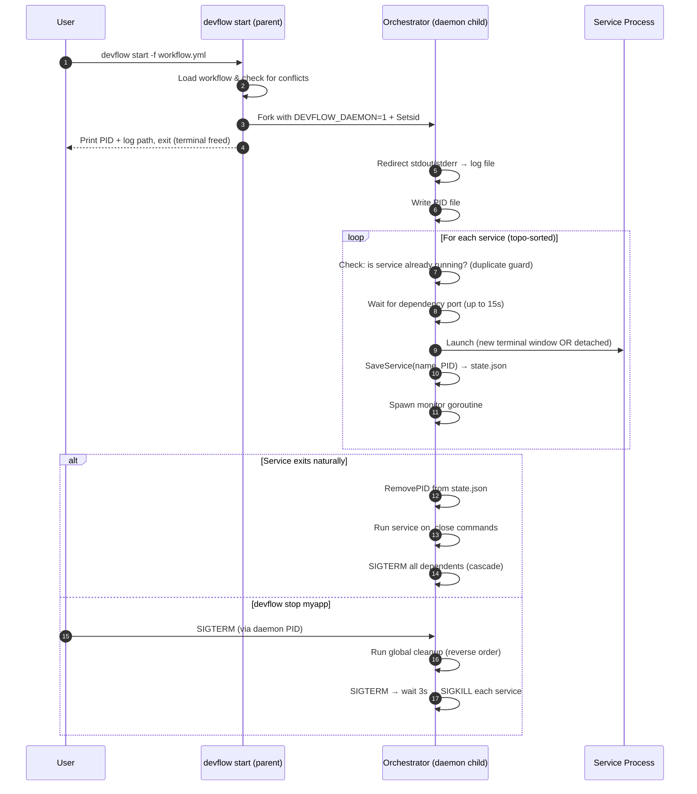

# DevFlow — Command Orchestrator

> **Start your entire dev stack with one command. Stop it cleanly. Never worry about the order again.**

DevFlow is a Go-based CLI tool that reads a simple YAML file describing your services (databases, backends, frontends, background workers) and launches them in the right order, in their own terminal windows or as silent background processes. When you're done, it shuts everything down gracefully — running your cleanup commands in reverse dependency order.

---

## Table of Contents

- [Why DevFlow?](#why-devflow)
- [Installation](#installation)
- [Quick Start](#quick-start)
- [Workflow YAML Reference](#workflow-yaml-reference)
- [Commands](#commands)
- [Daemon Mode](#daemon-mode)
- [Active Services & Stopping](#active-services--stopping)
- [Logging](#logging)
- [How It Works Internally](#how-it-works-internally)
- [Project Structure](#project-structure)

---

## Why DevFlow?

When working on multi-service projects (e.g. a database + backend API + frontend), you typically:

1. Open multiple terminals
2. Start each service manually, remembering the right order
3. Forget to stop one service when shutting down
4. Wonder why your database got corrupted

DevFlow solves all of this declaratively.

---

## Installation

### From source

```bash
git clone https://github.com/anandyadav3559/devflow
cd devflow
go install .
```

### Requirements

- Go 1.21+
- A supported terminal emulator: `gnome-terminal`, `kgx`, `kitty`, `alacritty`, `xfce4-terminal`, `konsole`, or `xterm`

---

## Quick Start

**1. Write a workflow file** (`workflows/myapp.yml`):

```yaml
workflow_name: myapp

services:
  database:
    command: docker
    args: ["compose", "up"]
    path: ~/myapp/infra
    port: 5432
    on_close:
      command: docker
      args: ["compose", "down"]

  backend:
    command: uv
    args: ["run", "manage.py", "runserver"]
    path: ~/myapp/backend
    depends_on: ["database"]
    on_close:
      - command: echo
        args: ["Backend shutting down..."]

  frontend:
    command: npm
    args: ["run", "dev"]
    path: ~/myapp/frontend
    depends_on: ["backend"]
```

**2. Start everything:**

```bash
devflow start -f workflows/myapp.yml
```

DevFlow will:
- Sort services by dependency order (`database → backend → frontend`)
- Wait for the database's port 5432 to be ready before starting the backend
- Open each service in its own terminal window
- Start the orchestrator as a background daemon (your terminal is immediately free)

**3. Check what's running:**

```bash
devflow active
```

**4. Stop everything:**

```bash
devflow stop myapp
```

---

## Workflow YAML Reference

```yaml
workflow_name: string        # Required. Unique name for this workflow.
log: bool                    # Optional. Enable logging for all services.
on_close:                    # Optional. Global cleanup commands run after all services stop.
  - command: string
    args: [string]

services:
  <service-name>:
    command: string          # Required. Binary or command to run.
    args: [string]           # Optional. Arguments to pass.
    path: string             # Optional. Working directory (supports ~).
    port: int                # Optional. Port to poll before starting dependents.
    depends_on: [string]     # Optional. Services that must start first.
    detached: bool           # Optional. Run silently in background (no terminal window).
    log: bool                # Optional. Capture stdout/stderr to a log file.
    vars:                    # Optional. Environment variables to inject.
      KEY: value
    on_close:                # Optional. Cleanup command(s) when this service exits.
      command: string        # Single command form
      args: [string]
      # OR list form:
      - command: string
        args: [string]
        path: string         # Override working dir for this cleanup command
```

### Field Details

| Field | Description |
|-------|-------------|
| `command` | The executable to run. Can be a full path or a name on `$PATH`. |
| `args` | Array of arguments, passed directly without shell interpretation. |
| `path` | Working directory. Supports `~` for home directory expansion. |
| `port` | If set, DevFlow polls this TCP port (up to 15s) before starting any service that `depends_on` this one. |
| `depends_on` | List of service names that must be started first. DevFlow uses topological sort to find the correct launch order. |
| `detached` | If `true`, runs as a silent background process with no terminal window. Output goes to the log file only. |
| `log` | If `true`, captures all stdout/stderr to `~/.config/devflow/logs/<workflow>-<timestamp>/<service>.log`. |
| `vars` | Key-value pairs injected as environment variables into the process. |
| `on_close` | Command(s) to run when this service exits (or is stopped). Run in reverse dependency order during global shutdown. |

---

## Commands

### `devflow build`

Validates a workflow YAML and registers it in the local DevFlow registry. Registered workflows can be started by name from anywhere.

```bash
devflow build -f workflows/myapp.yml
```

- Checks for syntax errors and circular dependencies
- Snapshots the workflow into `~/.config/devflow/flows/`
- Assigns a unique ID for tracking
- If a workflow with that name already exists, prompts you interactively to rename it

```bash
devflow build -f workflows/myapp.yml -n my_custom_name   # register under a custom name
devflow build -f workflows/myapp.yml --force             # overwrite existing
```

---

### `devflow start`

Starts a workflow. By default, runs as a background **daemon** so your terminal is immediately freed.

```bash
devflow start -f workflows/myapp.yml      # from a file
devflow start -n myapp                    # from a registered workflow
devflow start --no-daemon -f ...          # keep it in the foreground (Ctrl+C to stop)
```

**Conflict handling:** If any service in the workflow is already running, DevFlow prompts you interactively to rename the conflicting service(s) or skip them, rather than failing hard.

```
⚠  Service "database" is already running in workflow "myapp" (PID 1234).
   Enter a new name for this service (or press Enter to skip): database2
   ✓ Will start as "database2" instead.
```

---

### `devflow active`

Lists all currently running services across all workflows.

```bash
devflow active
```

```
WORKFLOW   SERVICE    PID     TYPE       STARTED
────────   ───────    ───     ────       ───────
myapp      database   18423   terminal   2026-03-25T14
myapp      backend    18451   terminal   2026-03-25T14
myapp      redis      18488   detached   2026-03-25T14
```

- **terminal** — running in its own terminal window
- **detached** — running silently in the background

---

### `devflow stop`

Stop an entire workflow or a single service within it.

```bash
devflow stop myapp                  # stop all services in the workflow
devflow stop myapp.database         # stop only the "database" service
```

On workflow stop, DevFlow sends `SIGTERM` to the orchestrator daemon, which triggers the full cleanup cascade (service `on_close` commands, in reverse dependency order).

---

### `devflow ls`

Lists all registered workflows.

```bash
devflow ls
```

---

### `devflow rm`

Remove a registered workflow from the registry.

```bash
devflow rm myapp
```

---

## Daemon Mode

When you run `devflow start`, the orchestrator **forks itself into the background** immediately:

```
$ devflow start -f workflows/myapp.yml
✓ DevFlow daemon started  PID=12345
  Logs → ~/.config/devflow/logs/devflow-daemon-20260325-140951.log
  Run 'devflow stop myapp' to terminate.
$   ← prompt returns immediately
```

The daemon process:
- Runs in a new session (`setsid`) — **closing the terminal does NOT kill the daemon**
- Redirects its own output to the timestamped daemon log file
- Writes its PID to `~/.config/devflow/devflow.pid`
- Opens service terminal windows on your display
- Waits for all services to exit, then runs cleanup

To see the daemon's own output in real time:
```bash
tail -f ~/.config/devflow/logs/devflow-daemon-*.log
```

Use `--no-daemon` if you want the old blocking behavior:
```bash
devflow start --no-daemon -f workflows/myapp.yml
# Press Ctrl+C to stop everything
```

---

## Active Services & Stopping

Every service (both terminal and detached) is tracked in:
```
~/.config/devflow/storage/<workflow-name>.state.json
```

`devflow active` reads these state files and filters out any dead PIDs automatically — so the list is always current even if services were killed externally.

---

## Logging

Log files are created at:
```
~/.config/devflow/logs/<workflow-name>-<timestamp>/<service-name>.log
```

Enable logging per-service with `log: true` or globally for the entire workflow with a top-level `log: true`.

Daemon orchestrator logs:
```
~/.config/devflow/logs/devflow-daemon-<timestamp>.log
```

---

## How It Works Internally



### Dependency Resolution

DevFlow uses **Kahn's topological sort algorithm**. Given:
```
frontend → backend → database
```

The launch order is guaranteed to be: `database`, then `backend`, then `frontend`. The cleanup order is the reverse.

### Graceful Shutdown Policy

For each service process:
1. Send `SIGTERM`
2. Poll every 100ms for up to 3 seconds
3. If still alive, send `SIGKILL`

This prevents database corruption and gives services time to flush buffers.

---

## Project Structure

```
devflow/
├── main.go                          # Entry point — wires cobra root command
├── cmd/                             # CLI commands (one file per command)
│   ├── root.go                      # cobra root, global flags
│   ├── build.go                     # devflow build
│   ├── start.go                     # devflow start (daemon fork logic)
│   ├── active.go                    # devflow active
│   ├── stop.go                      # devflow stop
│   ├── ls.go                        # devflow ls
│   └── rm.go                        # devflow rm
├── services/                        # Core service execution layer
│   ├── loader.go                    # YAML workflow parser
│   ├── runner.go                    # RunService — detached or terminal
│   ├── terminal.go                  # Terminal emulator detection & launch
│   └── scheduler/                   # Orchestration engine
│       ├── scheduler.go             # Start/StartDaemon, service loop, state tracking
│       ├── sorter.go                # Kahn's topological sort
│       └── cleanup.go               # Graceful shutdown, cascade kill, on_close
├── internal/
│   └── storage/                     # Persistent state & registry
│       ├── types.go                 # Workflow, Service, CleanupCommand types
│       ├── state.go                 # Per-run ActiveEntry tracking (PIDs)
│       ├── workflows.go             # Registered workflow registry (workflows.json)
│       ├── paths.go                 # All ~/.config/devflow/* paths
│       └── bootstrap.go            # Directory initialization
└── workflows/                       # Example workflow files
```

Each subdirectory has its own README with detailed explanations of the code within it.
